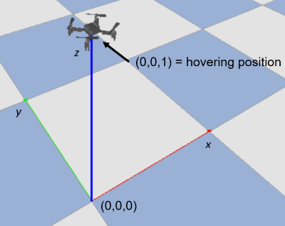

# Deep Reinforcement Learning Models for a Drone Hovering Task
Welcome to the repository of my Bachelor's thesis, which was conducted at the Department of Electrical and Computer Engineering at [TUM](https://www.tum.de/). The topic of this thesis is "Sample Complexity Analysis of Transfer Learning for Deep Reinforcement Learning Models".

In context of this Bachelor's thesis, I implement different deep Reinforcement Learning (RL) models on a drone to perform a hovering task in a Transfer Learning (TL) setting; first I pre-train the RL models on the differential equations-based simulation environment of the drone where an amount of knowledge is acquired, then I transfer this knowledge by post-training the models on a [PyBullet](https://github.com/bulletphysics/bullet3)-based 3D simulation environment. By means of commonly used metrics, I evaluate the benefits of TL to the learning process of the desired task compared to the case where no knowledge is transferred. Furthermore and most importantly, I analyze the sample complexity of the post-training of the implemented deep RL algorithms. This allows me to draw conclusions about which models deliver the overall best performance and are most appropriate for the combination of deep RL with TL in this specific use case.

For a more detailed discussion please refer to my [thesis](https://github.com/Malekba98/Deep_Reinforcement_Learning_Bachelor_thesis/blob/main/report_and_presentation/report.pdf) and [presentation](https://github.com/Malekba98/Deep_Reinforcement_Learning_Bachelor_thesis/blob/main/report_and_presentation/presentation.pdf).

This repository contains implementations of the differential equations-based and the [PyBullet](https://github.com/bulletphysics/bullet3)-based simulation environments used in this thesis, which were forked from a previous version of this [repository](https://github.com/SvenGronauer/phoenix-drone-simulation). Furthermore, it contains implementations of the training and evaluation pipelines of the different deep RL methods I used in my work, namely PPO, SAC, DDPG and TD3.

Hovering Task 
--- 
In the considered task, the aim is to control the drone to maintain its position at (0,0,1).



## Overview of Simulation Environments

|                                       | Task           | Physics            | Observation Frequency | Domain Randomization |  *Aerodynamic effects*  |
|-------------------------------------: | :----------:   | :----------------: | :-------------------: | :------------------: | :-------------------------: |
| `DroneHoverPIDSystemEqEnv-v0`         | Hover          | Differential Equations |  100 Hz |  10%        |   None |                 
| `DroneHoverPIDBulletEnv-v0`           | Hover          | PyBullet     |  100 Hz |        10%     |             Drag |                 


# Installation and Requirements

This code was tested using:

* Ubuntu 18.04 LTS
* Python 3.7

To clone and install the repository, run the following three lines:
```
$ git clone https://github.com/Malekba98/Deep_Reinforcement_Learning_Bachelor_thesis.git
$ cd Deep_Reinforcement_Learning_Bachelor_thesis/
$ pip install -e .
```

## Getting Started
